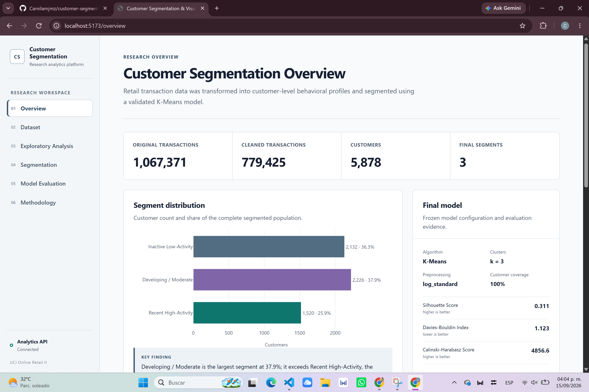
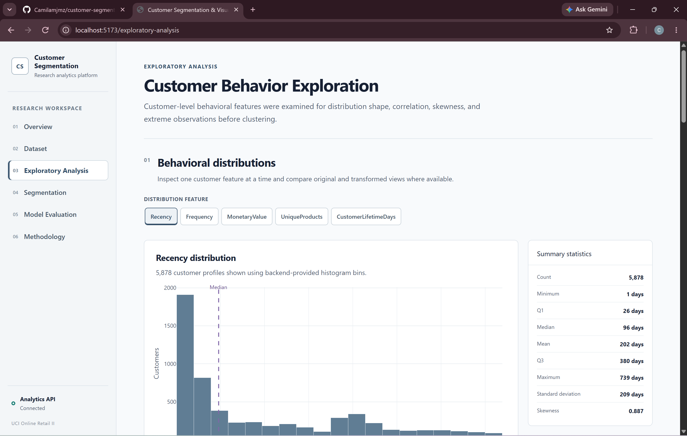
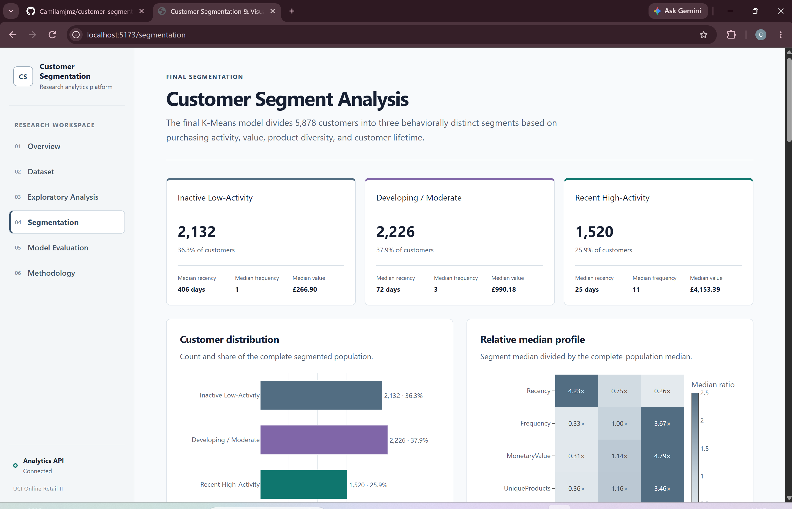
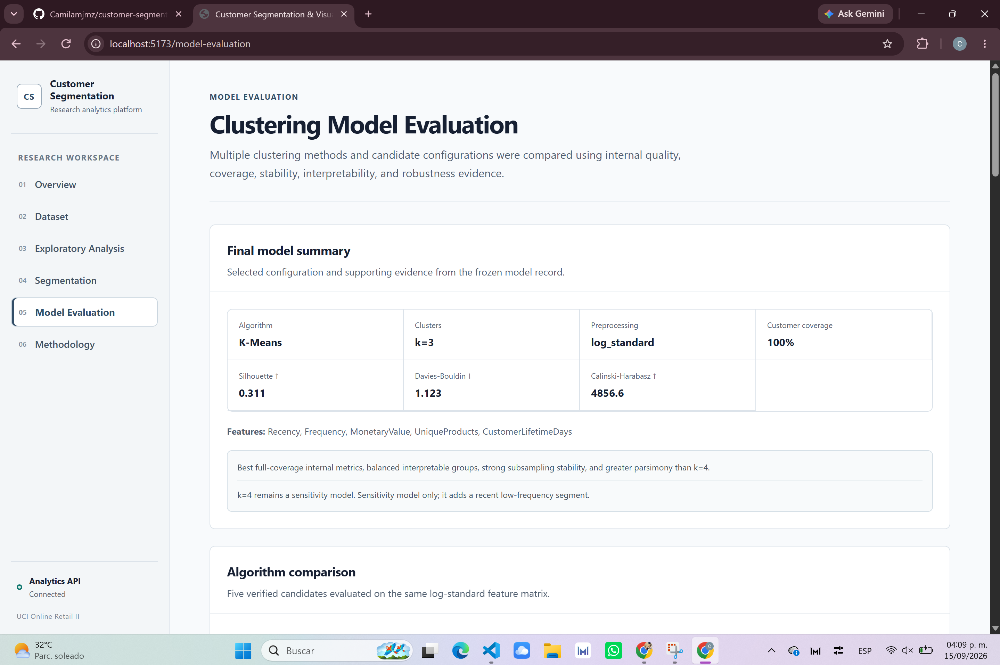

# Customer Segmentation & Visual Analytics Platform

## Project overview

This repository contains an undergraduate full-stack data analytics and machine learning project built around the UCI Online Retail II dataset. It transforms raw retail transactions into customer-level behavioral profiles, compares clustering alternatives through reproducible experiments, freezes a validated final segmentation, and presents the evidence through a six-page interactive web application.

The application is research-oriented: analytical claims are generated deterministically from verified project outputs exposed through a read-only FastAPI service.

## Research objective

The project investigates how transaction histories can be converted into interpretable customer segments and communicated through interactive visual analytics. Model selection considers internal quality, coverage, stability, feature sensitivity, balance, interpretability, and parsimony rather than relying on a single score.

## Dataset

The project uses [Online Retail II](https://archive.ics.uci.edu/dataset/502/online+retail+ii) from the UCI Machine Learning Repository (Daqing Chen, 2012; [DOI 10.24432/C5CG6D](https://doi.org/10.24432/C5CG6D)). It contains two years of transactions from a UK-based non-store retailer.

| Measure | Verified value |
| --- | ---: |
| Original transactions | 1,067,371 |
| Cleaned transactions | 779,425 |
| Final customer profiles | 5,878 |
| Countries | 41 |

The workbook contains the `Year 2009-2010` and `Year 2010-2011` sheets. To keep the Git repository compact, the raw XLSX workbook is intentionally not versioned. Download it from the verified UCI source above and place it at:

```text
data/raw/online_retail_II.xlsx
```

## Data preparation

The reproducible pipeline combines both sheets and sequentially removes exact duplicates, records without Customer ID, invalid dates, cancelled invoices, nonpositive quantities, and nonpositive prices. Valid line values are calculated as `Quantity × Price`, then aggregated to one row per customer. The source workbook is never overwritten.

Preparation decisions and removal counts are documented in [`docs/data_preparation.md`](docs/data_preparation.md).

After placing the workbook in `data/raw/`, regenerate the customer-level processed dataset from the repository root with:

```powershell
cd backend
.\.venv\Scripts\Activate.ps1
python scripts\prepare_data.py
```

The repository retains the processed customer features, clustering matrices, experiment summaries, notebooks, documentation, and frozen final-model artifacts required to inspect and run the completed analysis without committing the raw workbook.

## Feature engineering

| Final feature | Behavioral meaning |
| --- | --- |
| Recency | Days between the last purchase and the fixed reference date |
| Frequency | Number of distinct valid invoices |
| MonetaryValue | Total valid purchase value in pounds sterling |
| UniqueProducts | Number of distinct products purchased |
| CustomerLifetimeDays | Days between the first and last valid purchase |

TotalItems, AverageOrderValue, and AverageItemsPerOrder remain available for profiling and sensitivity analysis. Country is retained for description and filtering rather than included in the numerical distance matrix.

## Exploratory analysis

Customer-level exploration examines distributions, skewness, correlations, geographic imbalance, and Tukey-rule outliers. MonetaryValue and TotalItems have a Pearson correlation of approximately 0.875, supporting the decision not to include both primary volume measures. Extreme customers were investigated and retained rather than automatically treated as errors.

See [`notebooks/01_exploratory_analysis.ipynb`](notebooks/01_exploratory_analysis.ipynb) and [`docs/exploratory_analysis.md`](docs/exploratory_analysis.md).

## Preprocessing

The final strategy applies `log1p` to Frequency, MonetaryValue, and UniqueProducts. This compresses right-skewed magnitudes without removing customers or changing their ordering. Recency and CustomerLifetimeDays remain untransformed. StandardScaler then places all five variables on comparable scales before Euclidean-distance clustering.

Standard, log-standard, and log-robust alternatives were preserved for controlled comparison.

## Clustering experiments

The initial K-Means experiment compared three preprocessing strategies, `k=2` through `k=8`, and five random seeds: 105 controlled runs. Candidate profiles were interpreted in original business units. The broader comparison evaluated:

- K-Means
- Ward hierarchical agglomerative clustering
- DBSCAN

DBSCAN metrics were calculated only over non-noise observations, so they were considered alongside coverage rather than compared naively with full-coverage solutions.

## Final model

| Setting | Final value |
| --- | --- |
| Algorithm | K-Means |
| Clusters | 3 |
| Preprocessing | log1p followed by StandardScaler |
| `random_state` | 42 |
| `n_init` | 20 |
| Coverage | 100% |
| Silhouette Score | 0.3110 |
| Davies-Bouldin Index | 1.1230 |
| Calinski-Harabasz Score | 4,856.59 |

K-Means k=3 combined the strongest verified full-coverage internal metrics with balanced, interpretable groups, strong stability, complete assignment, and a simpler structure than k=4. K-Means k=4 remains a sensitivity model rather than a failed alternative.

## Customer segments

| Segment | Customers | Share |
| --- | ---: | ---: |
| Inactive Low-Activity | 2,132 | 36.27% |
| Developing / Moderate | 2,226 | 37.87% |
| Recent High-Activity | 1,520 | 25.86% |

These names summarize observed purchasing behavior. They do not establish intent, profitability, or causality.

## Model validation

Validation includes random-initialization stability, twenty 80% customer subsamples, and a controlled substitution of TotalItems for MonetaryValue. K-Means k=3 achieved mean subsampling Adjusted Rand Index (ARI) of 0.9801, indicating highly similar assignments under changes in sampled customer composition.

k=4 showed stronger feature-substitution agreement and identified an additional recent low-frequency group. It was retained for sensitivity analysis because its internal quality and subsampling stability were weaker and its fourth boundary increased interpretive complexity.

## Application features

The React application presents the research through six connected sections:

1. **Overview** — population, final model, segment distribution, and profile summary.
2. **Dataset** — workbook structure, cleaning evidence, country distribution, and feature dictionary.
3. **Exploratory Analysis** — distributions, correlation heatmap, outliers, and preprocessing visualization.
4. **Segmentation** — customer scatter exploration, segment and country filters, detailed tooltips, profiles, within-segment distributions, and paginated examples.
5. **Model Evaluation** — algorithm metrics, DBSCAN coverage and noise, robustness, feature sensitivity, and selection evidence.
6. **Methodology** — the research sequence, analytical decisions, final configuration, limitations, and reproducibility.

Interpretations are deterministic and based on backend values; the project does not generate analysis using an LLM.

## Screenshots

### Overview



### Exploratory Analysis



### Customer Segmentation



### Model Evaluation



## Technology stack

| Layer | Technologies |
| --- | --- |
| Frontend | React, TypeScript, Vite, Tailwind CSS, Plotly, React Router |
| Backend | Python, FastAPI, Uvicorn, Pydantic |
| Analytics | Pandas, NumPy, Scikit-learn, Matplotlib |
| Data | Online Retail II, XLSX and CSV research artifacts |
| Verification | Python `unittest`, TypeScript compilation, Vite production build |

## Architecture

```text
UCI Online Retail II workbook
            |
            v
Reproducible data preparation
            |
            v
Engineered customer profiles
            |
            v
Preprocessing alternatives
            |
            v
Clustering experiments and profile comparison
            |
            v
Robustness validation
            |
            v
Frozen final segmentation and saved evidence
            |
            v
Read-only FastAPI analytics API
            |
            v
React + Plotly visual analytics frontend
```

The backend reads verified artifacts and does not retrain the model in response to frontend requests.

## Repository structure

```text
customer_segmentation/
├── backend/
│   ├── app/                 # FastAPI routes, schemas, and services
│   ├── scripts/             # Preparation, experiments, validation, and model freeze
│   ├── tests/               # Backend and research-integrity tests
│   └── requirements.txt
├── data/
│   ├── raw/                 # Preserved raw workbook copy
│   ├── processed/           # Customer and clustering feature tables
│   ├── experiments/         # Saved experiment outputs
│   └── final/               # Frozen segmentation and model metadata
├── docs/                    # Research and API documentation
├── frontend/
│   ├── src/                 # React pages, charts, services, and types
│   └── package.json
├── notebooks/               # Research notebooks
├── README.md
└── .gitignore
```

## Running the project locally

These instructions use Windows PowerShell and begin at the repository root. Python and Node.js/npm must already be installed.

### Backend

Create the environment once, install dependencies, and run the API:

```powershell
cd backend
py -m venv .venv
.\.venv\Scripts\Activate.ps1
pip install -r requirements.txt
uvicorn app.main:app --reload
```

For later sessions, activate the existing environment before starting Uvicorn:

```powershell
cd backend
.\.venv\Scripts\Activate.ps1
uvicorn app.main:app --reload
```

- Backend: <http://localhost:8000>
- Health endpoint: <http://localhost:8000/health>
- Swagger documentation: <http://localhost:8000/docs>

### Frontend

In a second PowerShell terminal:

```powershell
cd frontend
npm install
npm run dev
```

Open <http://localhost:5173>. Keep the backend running on port 8000 so analytical content can load.

## Deployment preparation

The intended deployment separates the read-only API from the static single-page application. No public deployment URLs are documented until those services exist.

### Render backend

Create a Python web service from this repository with:

| Setting | Value |
| --- | --- |
| Root directory | `backend` |
| Build command | `pip install -r requirements.txt` |
| Start command | `uvicorn app.main:app --host 0.0.0.0 --port $PORT` |
| Health check path | `/health` |

Set the following environment variable after the Vercel production URL exists:

```text
FRONTEND_ORIGINS=https://your-vercel-production-domain.example
```

`FRONTEND_ORIGINS` accepts a comma-separated list when more than one deployed frontend origin is required. Local development at `http://localhost:5173` remains enabled without configuration. No database credentials, API keys, or raw workbook are required at runtime.

### Vercel frontend

Create a Vite project from the same repository with:

| Setting | Value |
| --- | --- |
| Root directory | `frontend` |
| Build command | `npm run build` |
| Output directory | `dist` |

Set the frontend API origin to the eventual Render service URL:

```text
VITE_API_BASE_URL=https://your-render-service.example
```

The value should not end with a slash. [`frontend/vercel.json`](frontend/vercel.json) rewrites direct requests to `index.html`, allowing React Router routes to load correctly after navigation or browser refresh.

## API overview

All analytical endpoints are read-only.

| Endpoint | Purpose |
| --- | --- |
| `GET /health` | Service health |
| `GET /api/overview` | Dataset and final-model overview |
| `GET /api/dataset` | Source, cleaning, country, and feature metadata |
| `GET /api/eda/distributions?feature=...` | Feature distribution and histogram |
| `GET /api/eda/correlations` | Pearson correlations |
| `GET /api/eda/outliers` | Tukey-rule outlier summaries |
| `GET /api/segments` | Final segment summaries |
| `GET /api/segments/{segment_id}` | Detailed segment profile |
| `GET /api/segments/distributions` | Per-segment distribution summaries |
| `GET /api/customers` | Filtered, paginated customer assignments |
| `GET /api/model` | Frozen final-model configuration |
| `GET /api/model/comparison` | Algorithm comparison |
| `GET /api/model/validation` | k=3 and k=4 robustness evidence |
| `GET /api/methodology` | Ten-stage workflow |

Schemas and example responses are available through Swagger at <http://localhost:8000/docs>.

## Testing

With the backend virtual environment activated:

```powershell
cd backend
python -m unittest discover -s tests -v
```

The latest repository verification completed **47 backend tests successfully**. The suite covers preparation invariants, preprocessing safety, clustering reproducibility, profiling, comparison, validation, API integrity, filtering, and pagination.

Verify frontend TypeScript compilation and the production bundle with:

```powershell
cd frontend
npm run build
```

## Limitations

- Customers are strongly concentrated in the United Kingdom, limiting geographic generalization.
- The historical observation period ends in 2011 and may not represent current purchasing behavior.
- Segment meaning depends on the selected features and observation window.
- K-Means assumes compact structure under Euclidean distance after preprocessing.
- The segmentation is descriptive rather than causal.
- No external business outcome was used to validate segment value.
- Customer behavior and segment membership can change over time.

## Future work

- Evaluate segment movement across rolling or later time periods.
- Validate relationships between segments and external business outcomes.
- Extend sensitivity analysis with carefully justified behavioral features.
- Automate data refresh and reproducible model monitoring.
- Deploy the read-only API and frontend when an appropriate environment is selected.
